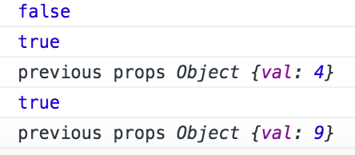

:books: React Fundamentals :books: 
===

React Fundamentals tutorial.
It can an be ran and opened with:

```
npm install
npm start
```
Navigate to http://localhost:3000/ to see the outcome.

Examples:
----
The right outcome can be seen when we update with the right example number in index.html

Example 1: Hello World - First Component


Example 2: The Render Method


Example 3: Introduction to Properties


Example 4: State Basics


Example 5: (Skipped)

Example 6: Using Refs to Access Components


Example 7: Accessing Child Properties


Example 8: Component Lifecycle - Mounting Basics


Example 9: Component Lifecycle - Mounting Usage


Example 10: Component Lifecycle - Updating


Example 11: Composable Components


Example 12: Dynamically Generated Components


Example 13: Build a JSX Live Compiler

